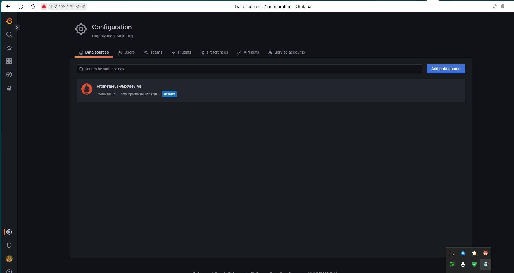
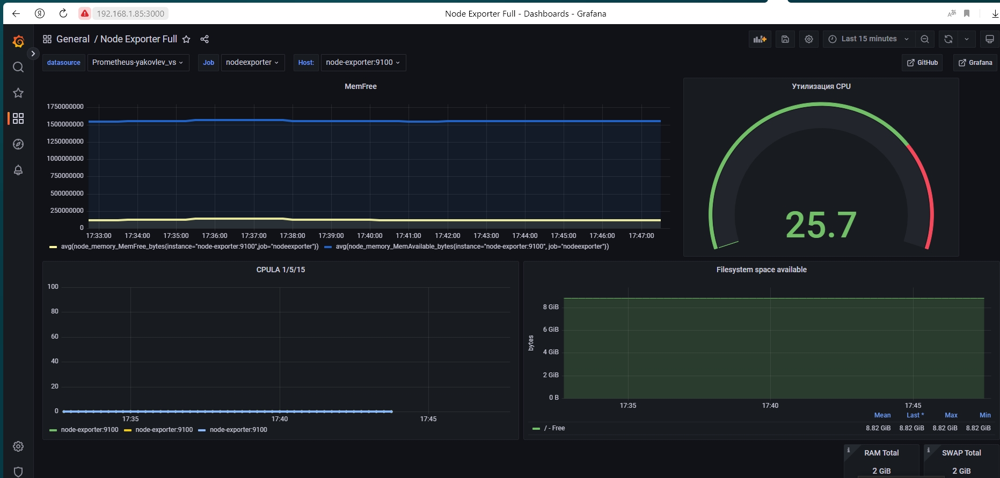
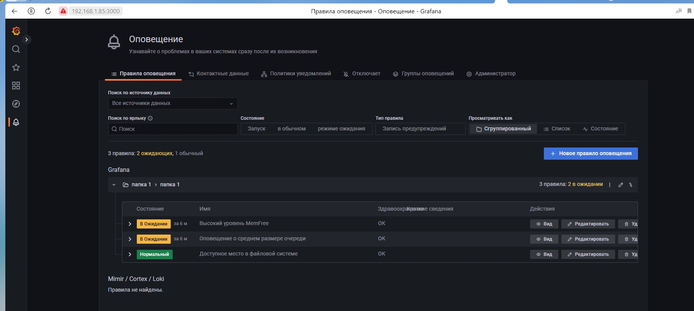
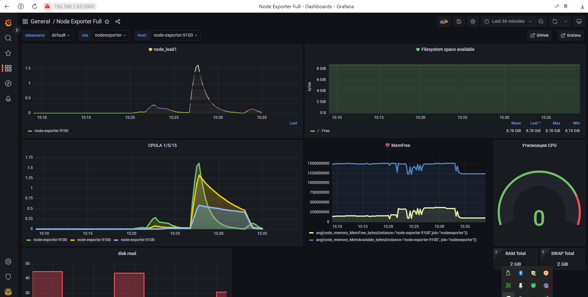
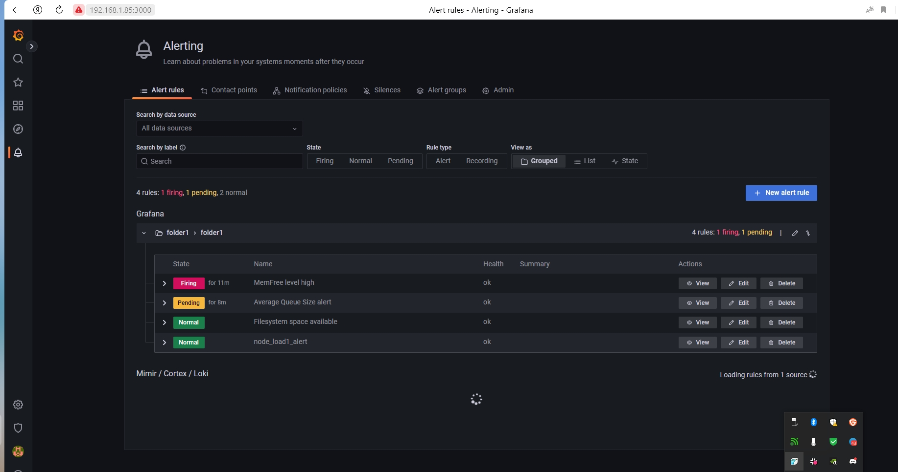

# Домашнее задание к занятию "10.03. Grafana" dev-17_10-monitoring-03-grafana-yakovlev_vs

monitoring-03-grafana

## Задание повышенной сложности

**В части задания 1** не используйте директорию [help](./help) для сборки проекта, самостоятельно разверните grafana, где в 
роли источника данных будет выступать prometheus, а сборщиком данных node-exporter:
- grafana
- prometheus-server
- prometheus node-exporter

За дополнительными материалами, вы можете обратиться в официальную документацию grafana и prometheus.

В решении к домашнему заданию приведите также все конфигурации/скрипты/манифесты, которые вы 
использовали в процессе решения задания.

**В части задания 3** вы должны самостоятельно завести удобный для вас канал нотификации, например Telegram или Email
и отправить туда тестовые события.

В решении приведите скриншоты тестовых событий из каналов нотификаций.

## Обязательные задания

### Задание 1
Используя директорию [help](./help) внутри данного домашнего задания - запустите связку prometheus-grafana.

Зайдите в веб-интерфейс графана, используя авторизационные данные, указанные в манифесте docker-compose.

Подключите поднятый вами prometheus как источник данных.

Решение домашнего задания - скриншот веб-интерфейса grafana со списком подключенных Datasource.

#### Решение




## Задание 2
Изучите самостоятельно ресурсы:
- [PromQL query to find CPU and memory](https://stackoverflow.com/questions/62770744/promql-query-to-find-cpu-and-memory-used-for-the-last-week)
- [PromQL tutorial](https://valyala.medium.com/promql-tutorial-for-beginners-9ab455142085)
- [Understanding Prometheus CPU metrics](https://www.robustperception.io/understanding-machine-cpu-usage)

Создайте Dashboard и в ней создайте следующие Panels:

#### Решение

- Утилизация CPU для nodeexporter (в процентах, 100-idle)

```bash
avg by(instance)(rate(node_cpu_seconds_total{job="nodeexporter",mode="idle"}[$__rate_interval])) * 100
```

- CPULA 1/5/15

```bash
avg by (instance)(rate(node_load1{}[$__rate_interval]))
avg by (instance)(rate(node_load5{}[$__rate_interval]))
avg by (instance)(rate(node_load15{}[$__rate_interval]))
```

- Количество свободной оперативной памяти

```bash
avg(node_memory_MemFree_bytes{instance="node-exporter:9100",job="nodeexporter"})
avg(node_memory_MemAvailable_bytes{instance="node-exporter:9100", job="nodeexporter"})
```

- Количество места на файловой системе

```bash
node_filesystem_free_bytes{fstype="ext4",instance="node-exporter:9100",job="nodeexporter"}
```


Для решения данного ДЗ приведите promql запросы для выдачи этих метрик, а также скриншот получившейся Dashboard.




## Задание 3
Создайте для каждой Dashboard подходящее правило alert (можно обратиться к первой лекции в блоке "Мониторинг").

Для решения ДЗ - приведите скриншот вашей итоговой Dashboard.

#### Решение







## Задание 4
Сохраните ваш Dashboard.

Для этого перейдите в настройки Dashboard, выберите в боковом меню "JSON MODEL".

Далее скопируйте отображаемое json-содержимое в отдельный файл и сохраните его.

В решении задания - приведите листинг этого файла.

#### Решение

- [dashboard.json](https://github.com/Valdem88/dev-17_10-monitoring-03-grafana-yakovlev_vs/blob/main/files/dashboard.json)


- [Файлы для сборки проекта](https://github.com/Valdem88/dev-17_10-monitoring-03-grafana-yakovlev_vs/tree/main/files/prometheus_stack)
---

### Как оформить ДЗ?

Выполненное домашнее задание пришлите ссылкой на .md-файл в вашем репозитории.

---